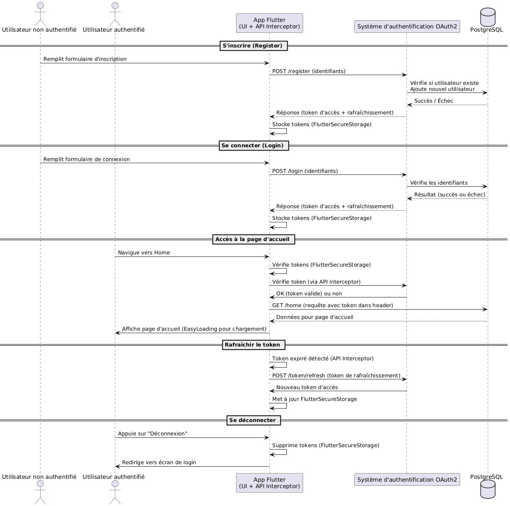

# Flutter OAuth2 Login avec PostgreSQL

Cette application est un exemple d'implémentation de login OAuth2 dans Flutter, avec un backend Express.js et une base de données PostgreSQL.

## Architecture du projet

- **Frontend**: Application Flutter avec authentification OAuth2
- **Backend**: Serveur Express.js avec PostgreSQL

## Processus d'authentification OAuth2 détaillé

OAuth2 est un protocole d'autorisation standardisé qui permet à une application tierce d'accéder à des ressources protégées au nom d'un utilisateur sans exposer ses identifiants. Dans cette application, nous avons implémenté un flux "Resource Owner Password Credentials" d'OAuth2, adapté aux applications natives comme Flutter.

### Les composants clés d'OAuth2 dans notre application

1. **Client** : L'application Flutter
2. **Serveur d'autorisation** : Notre serveur Express.js qui valide les identifiants et émet des tokens
3. **Ressource protégée** : Les API du serveur nécessitant une authentification
4. **Utilisateur** : La personne utilisant l'application Flutter

### Types de tokens implémentés

1. **Access Token** : Token à durée de vie courte (généralement 15-60 minutes) utilisé pour accéder aux ressources protégées
2. **Refresh Token** : Token à durée de vie longue (généralement plusieurs jours) utilisé pour obtenir de nouveaux access tokens sans réauthentification

### Cycle de vie des tokens

1. **Émission des tokens** : Lors de l'authentification réussie, le serveur génère un access_token et un refresh_token
2. **Stockage des tokens** : Les tokens sont stockés de façon sécurisée dans le dispositif de l'utilisateur via Flutter Secure Storage
3. **Utilisation de l'access token** : Envoyé dans l'en-tête HTTP `Authorization: Bearer <token>` pour chaque requête API
4. **Expiration de l'access token** : Lorsque le serveur renvoie une erreur 401 (Unauthorized)
5. **Utilisation du refresh token** : L'application envoie le refresh_token au serveur pour obtenir un nouvel access_token
6. **Révocation des tokens** : Lors de la déconnexion ou en cas de compromission

### Sécurité implémentée

- Stockage des tokens côté client avec chiffrement via Flutter Secure Storage
- Tokens JWT signés avec algorithme HMAC SHA-256 (HS256)
- Validation des tokens à chaque requête API
- Rotation des refresh tokens (un nouveau refresh token est émis à chaque utilisation)
- Protection contre les attaques de type CSRF et XSS

## Diagramme de séquence

Le diagramme ci-dessous illustre le flux d'authentification OAuth2 implémenté dans cette application:



### Flux d'authentification
1. L'utilisateur s'inscrit ou se connecte via l'application Flutter
2. Le serveur backend valide les identifiants et génère un access_token et un refresh_token
3. L'application stocke ces tokens de manière sécurisée
4. Pour chaque requête API, l'intercepteur ajoute le token d'accès
5. Lorsqu'un token expire (erreur 401), l'application utilise automatiquement le refresh_token pour obtenir de nouveaux tokens
6. Le backend vérifie la validité du refresh_token et émet de nouveaux tokens si valide

## Configuration requise

- Flutter (dernière version stable)
- Node.js et npm
- PostgreSQL

## Installation

### Configuration du backend (Express.js + PostgreSQL)

1. Configurez PostgreSQL en suivant les instructions dans [INSTALLATION_POSTGRESQL.md](INSTALLATION_POSTGRESQL.md)
2. Installez les dépendances du backend:
   ```bash
   cd backend
   npm install
   ```
3. Démarrez le serveur backend:
   ```bash
   npm run dev
   ```

### Configuration de l'application Flutter

1. Installez les dépendances Flutter:
   ```bash
   flutter pub get
   ```
2. Exécutez l'application:
   ```bash
   flutter run
   ```

## Fonctionnalités

- Authentification OAuth2 avec token et refresh token
- Stockage sécurisé des tokens avec Flutter Secure Storage
- API sécurisée avec intercepteurs HTTP
- Base de données PostgreSQL pour le stockage des utilisateurs et des tokens
